# Twäng POP! Sign

[Twäng](https://twaeng.de) released its [award-winning](https://casa.org/2022-contemporary-a-cappella-recording-awards-results/) debut album [POP!](https://twaeng.de/musik/pop) in September 2021. To celebrate the release, I created a small piece of hardware as an eye catcher to promote our music.

The sign was shown in a [local news item (German)](https://fudder.de/wie-war-s-bei-dem-konzert-von-twaeng-am-sonntag):

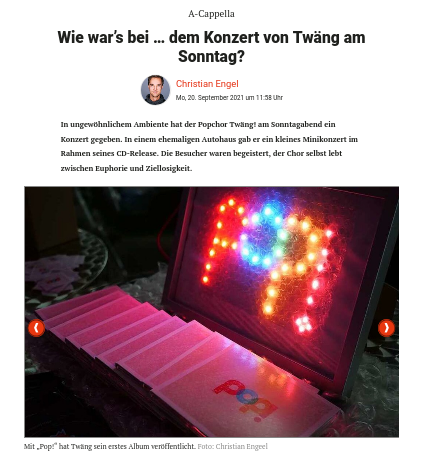

## Ingredients

### Background Music

Before continuing, please head over to one of the online places where you can listen to the music and put it on in the background ;)

 * [Spotify](https://open.spotify.com/album/5JWx3LHv84EIEcAznuIPzp)
 * [Others](https://twaeng.de/musik/pop)

 ![POP! Cover][cover]

[cover]: docs/pop-cover.webp

or [watch a recent live performance](https://www.youtube.com/watch?v=ba03ugF1Gfo) (without my participation).

### Hardware
 * WS2812B RGB LEDs on a small PCB (e.g. from ebay or aliexpress)
 * Raspberry Pi Pico
 * Another Raspberry Pi Pico (using [picoprobe](https://datasheets.raspberrypi.org/pico/getting-started-with-pico.pdf#%5B%7B%22num%22%3A60%2C%22gen%22%3A0%7D%2C%7B%22name%22%3A%22XYZ%22%7D%2C115%2C841.89%2Cnull%5D) for debugging)
 * 0.6mm copper wire
 * connection wires
 * picture frame
 * bubble wrap

### Tools
 * Soldering Iron
 * Side Cutters
 * Third-Hand Tool

## Building Log

### First version assembly

After one of the rehearsals for our small release concerts I had the idea of creating a small blinking sign.

Should I order a LED matrix to program or could I build something simpler myself? Looking around on youtube for
inspiration about how to get creative with WS2812B, I found [someone handling a string of these LEDs](https://youtu.be/vOYR6TfFR88?t=247)
each mounted on a small PCB. The LEDs were hold soldered together with a piece of wire.

That sounded promising, so I ordered a pack of 50 WS2812B LEDs from ebay on a whim.

They arrived two days later and came as a single PCB panel with [v-cuts](https://www.lioncircuits.com/faq/pcb-fab/what-is-v-groove%28v-cut-or-scoring%29) to break them off
easily.

The pico-examples repository contains examples for driving WS2812B. I compiled it without changes and uploaded it to the Pico using UF2. For the experiments, the data in
pin was connected to the GPIO that was configured in the example. The +5V connection was
connected to the 3V3 for now (for full brightness you can run WS2812B at +5V, but then you need to make sure that the signal level of the data line get to 0.7 times 5V which is 3.5V and therefore slightly too high to be driven by a 3V3 microcontroller. With my
pixels both using the VBUS pin (nominally at 5V USB voltage) and VSYS pin (VBUS - the voltage drop of a Zener Diode of ~0.3V, i.e. at ~ 4.7V) of the Pico both also work flawlessly.

Each WS2812B RGB LED, in fact, contains three LEDs of red, green, and blue color, together with a small IC for driving these LEDs.

They only use a single digital data line that needs to be chained through all the LEDs. Since there's no physical clock line,
the data rate is predefined and needs to be adhered to accurately to ensure proper transmission. Internally, each LED has a shift register which receives the 24 initial bits (the color value ordered as GRB), and propagates all the remaining bits. This happens until a RESET code is received (low voltage level for at least 50µs). Then all LEDs latch the received values into their display register and use PWM to set the perceived brightness per color led.

I got to work and soldered together the first few pixels. At the input side, I soldered
a few wires with pin connectors to try them out with the Raspberry Pi Pico.

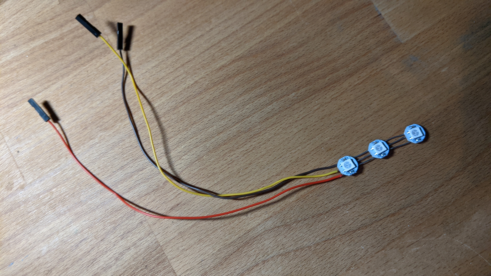

Connecting to the Pico and running the pico example without changes worked
well and showed the predefined animation patterns of the example.

This looked promising so I came up with a design about how to wire more of those LEDs to form the letters "pop!".

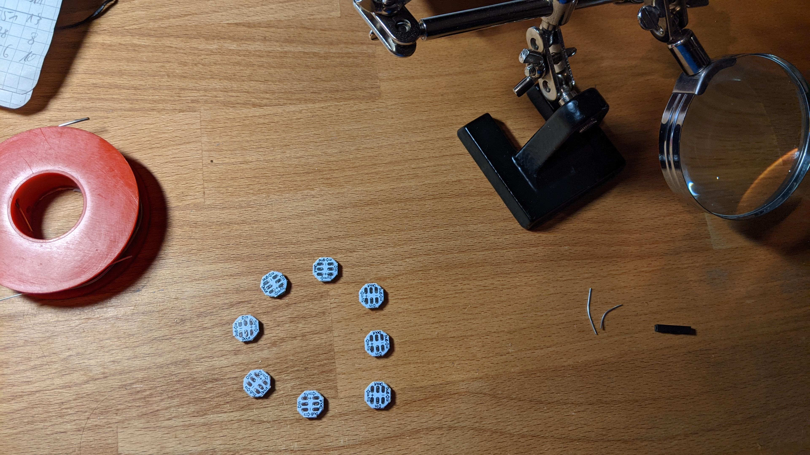

The copper wires are quite stiff, so you can form arbitrary shapes and the resulting form will be stiff enough for careful use.

Producing the rounded forms like the letter 'o' or 'p' was
challenging. You need to bend three small pieces of copper wire into a curved form making sure that those three wires which are only a few millimeters apart do not touch. After a bit of trial and error, the best technique was to start with the inner of those three wires and solder those first.

In my first attempts I tried to precut the wire into the right size but I could not handle the soldering of these small parts with my fumbly fingers. A better way was to keep the wire on its reel while soldering the first connection, and only cutting it right before soldering the other end. The third hand tool was indispensable, as you can imagine!

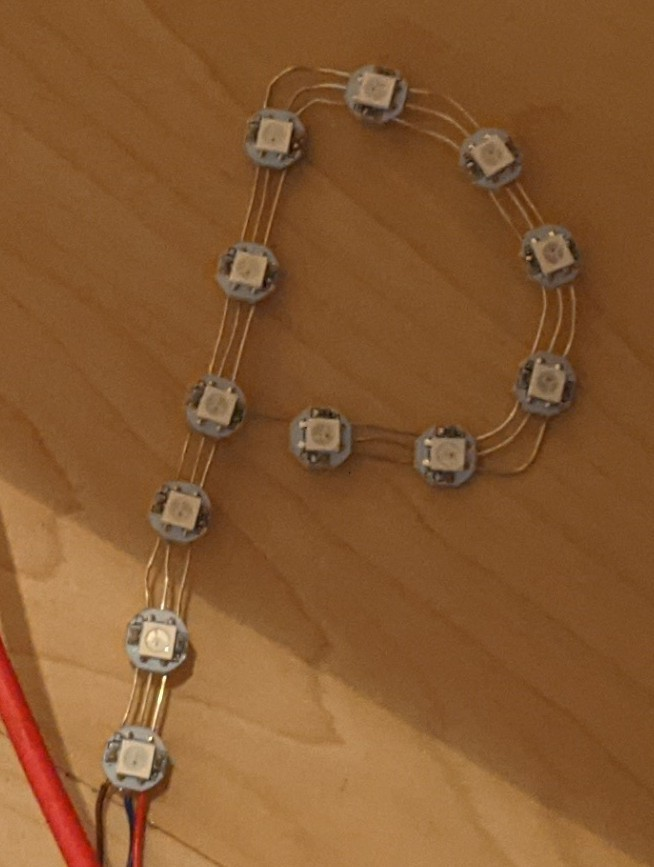

The first test on the full first letter revealed that the color scheme looked weird.

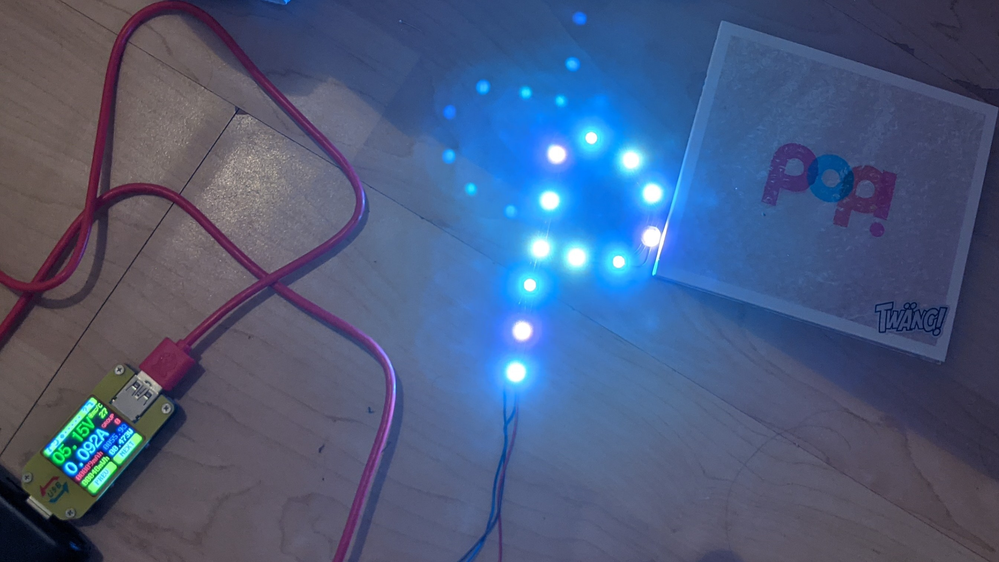

It turned out that the pico WS2812B example, expects a different LED type by default that uses a fourth color channel for a white LED. The `boolean rgbw` parameter passed to `ws2812_program_init` controls how many bits are sent per LED, so it was an easy fix to run with the RGB variant of the pixels.

I continued with my quest and soldered another letter. 

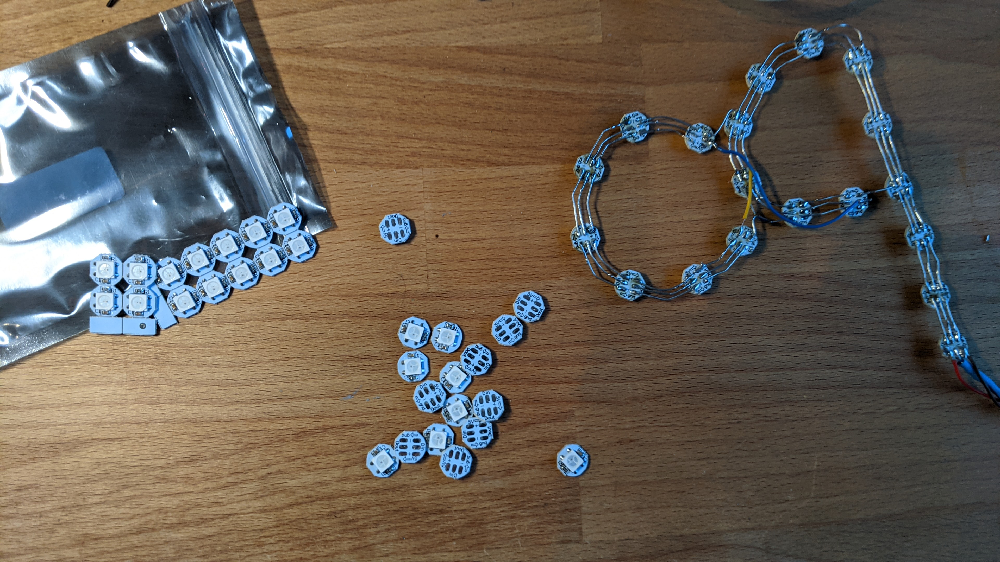

As you can see, some bridges are needed, first, to connect the inner rail of the power supply to the inner rail of the next letter (I chose to run all letters in the same direction, so the inner rail was `+5V`). Also, the `Dout` of the last pixel of one letter needs to be connected to the `Din` of the first letter of the next letter.

After three letters done, I started doing the first little bit of programming just to give each letter its own color:

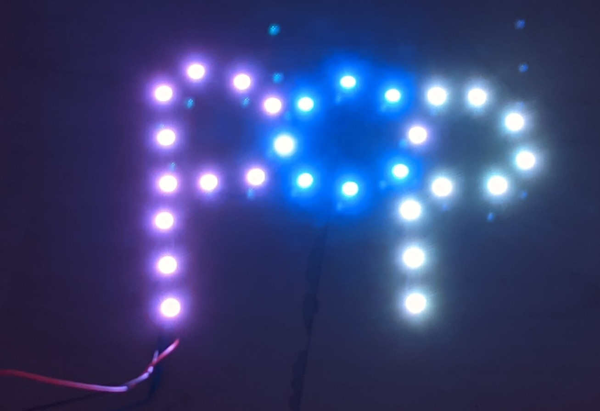

Finally, I had also finished the exclamation mark and real
programming could begin.

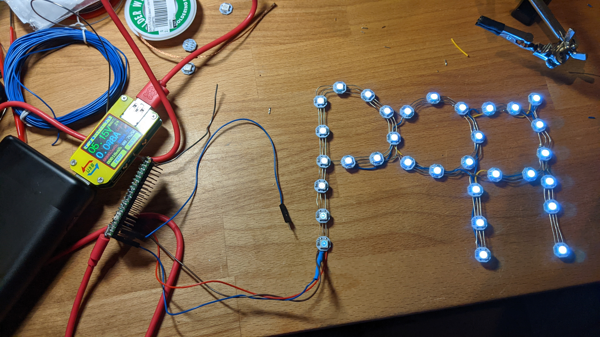

### Simple colors firmware

First, constants were defined for the colors per letter. 

```c
// COLOR_BRG converts R,G,B value to a 24bit BRG value as expected by WS2812B
const uint32_t p_1_color = COLOR_BRG(240, 5, 2);
const uint32_t p_1_o_color = COLOR_BRG(20, 0, 40);
const uint32_t o_color = COLOR_BRG(12, 35, 120);
const uint32_t o_p2_color = COLOR_BRG(28, 70, 6);
const uint32_t p_2_color = COLOR_BRG(200, 40, 0);
const uint32_t p_2_excl_color = COLOR_BRG(90, 13, 1);
const uint32_t excl_color = COLOR_BRG(150, 12, 8);
```

Determining the color values was not as straight-forward as expected. Turning on all LEDs with the same brightness value, did not gave a neutral white but was heavily shifted to blue. Two potential explanations come to mind:

 * colors are just not calibrated well
 * a voltage supply smaller than 5V might affect different colors in different ways (red LEDs have a smaller voltage drop than blue ones and there's no information about how WS2812B implement the constant current source for the LEDs and how it is affected by input voltage)

In the end, I found that a balanced white had an RGB value of 255, 130, 80.

TODO: add chaining schematics

The association between pixel IDs and letters was done using a simple bitmap:

```c
const int num_leds = 32;
const int p_1_leds[] = {1,1,1,1,1,1,1,1,1,1,1,1,0,0,0,0,0,0,0,0,0,0,0,0,0,0,0,0,0,0,0,0};
const int o_leds[] =   {0,0,0,0,0,0,0,0,0,1,0,0,1,1,1,1,1,1,1,0,0,0,0,0,0,0,0,0,0,0,0,0};
const int o_p_2_leds[]={0,0,0,0,0,0,0,0,0,0,0,0,0,0,0,1,0,0,0,0,0,0,0,0,0,0,0,0,0,0,0,0}; // only want that middle one
const int p_2_leds[] = {0,0,0,0,0,0,0,0,0,0,0,0,0,0,0,1,1,0,0,1,1,1,1,1,0,1,1,1,1,0,0,0};
const int excl_leds[]= {0,0,0,0,0,0,0,0,0,0,0,0,0,0,0,0,0,0,0,0,0,0,0,0,1,1,1,0,0,1,1,1};
```

By design, some pixels are shared between two letter and get their own colors.

Transmitting the colors works like this:

```c
void show_all(uint t) {
    for (int i = 0; i < num_leds; ++i) {
        if (p_1_leds[i] && o_leds[i])
            put_pixel(p_1_o_color);
        else if (p_1_leds[i])
            put_pixel(p_1_color);
        else if (o_p_2_leds[i])
            put_pixel(o_p2_color);
        else if (o_leds[i])
            put_pixel(o_color);
        else if (p_2_leds[i] && excl_leds[i])
            put_pixel(p_2_excl_color);
        else if (p_2_leds[i])
            put_pixel(p_2_color);
        else if (excl_leds[i])
            put_pixel(excl_color);
    }
}
```

That is, we cycle over all the LEDs and transmit the colors we want to see.

Here's the result:

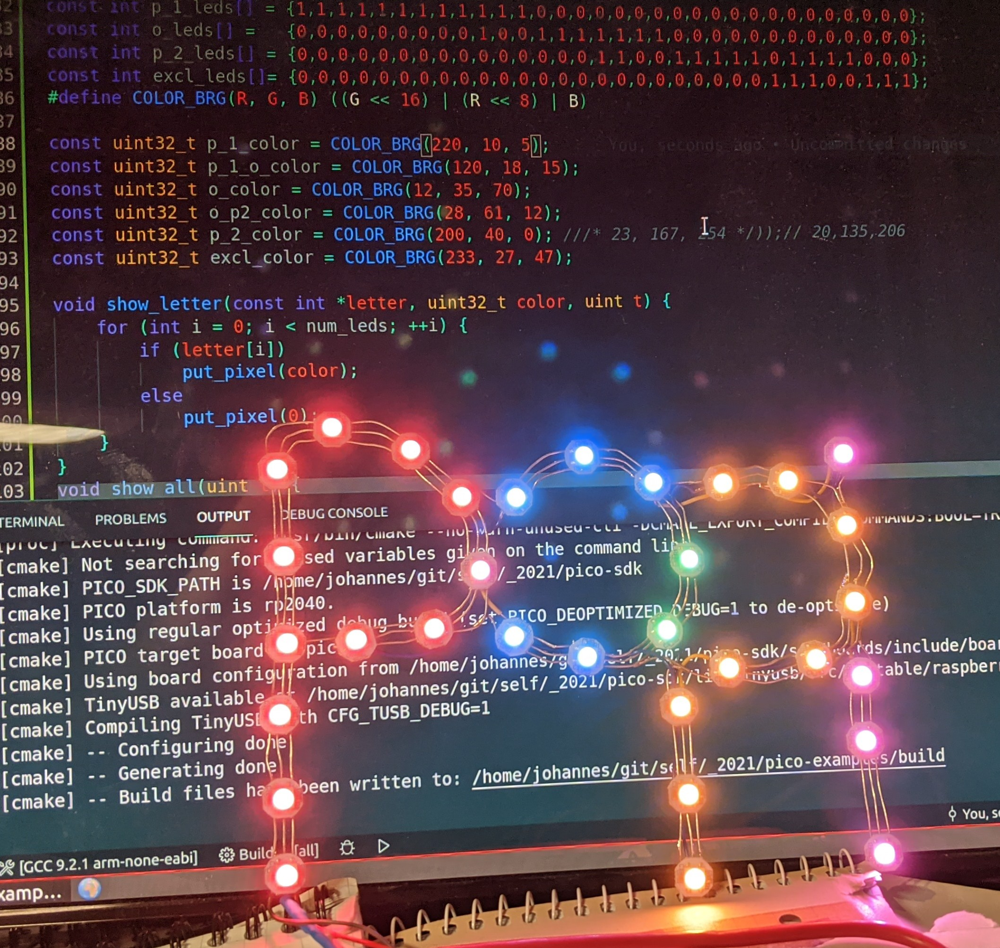

As a finishing touch I put it into a frame and added a sheet of paper and some bubble wrap for diffusion and style.

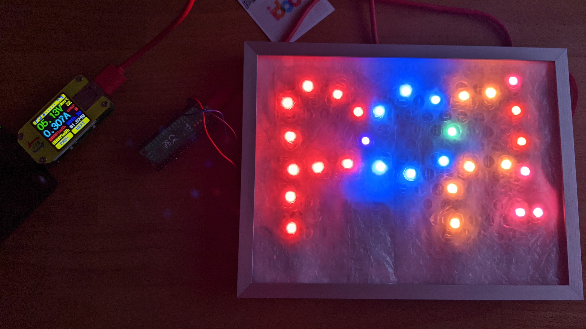

### Improved hardware version

User testing revealed that the letter shaping was not easily readable. This is no surprise as the initial version only had ~ 30 pixels which doesn't allow for much details. I had tried to mimic the album art by fusing adjacent letters. The result was nicely colorful but still not an obvious representation of the album cover.

Only a few days before the concert, I decided to redo the hardware slightly. Last minute changes to hardware are much more frightening than doing software fixups.

On one hand, there's only one piece of hardware available which already works, and if it gets broken in the process, there's no way of going back other than fixing whatever breaks. On the other hand, the software already depends on the topology of the hardware and also needs to be changed accordingly.

After all I overcame my fears and attempted some cosmetic surgery...

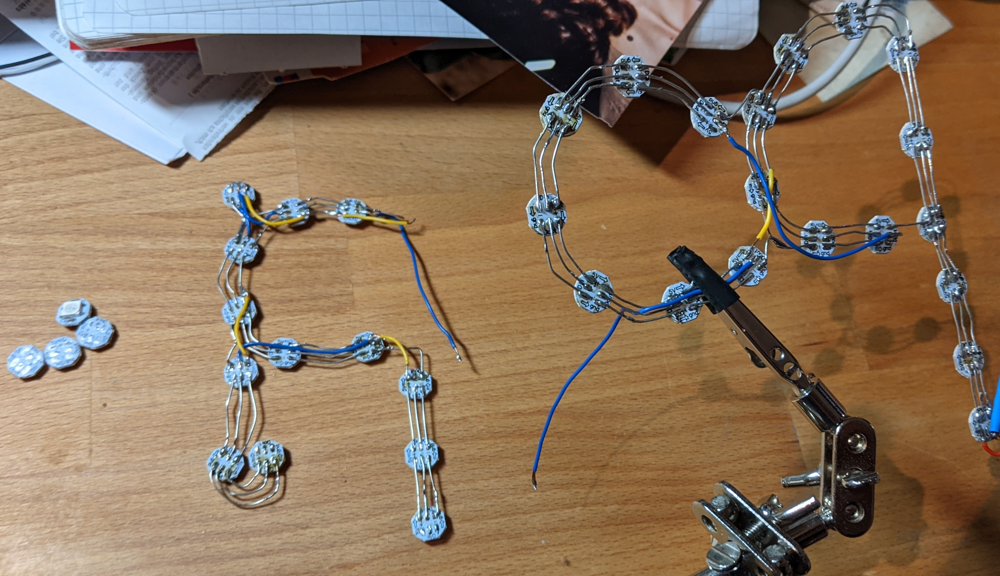

I added a few pixels here and there and made the separation between the letters and the exclamation mark clear.

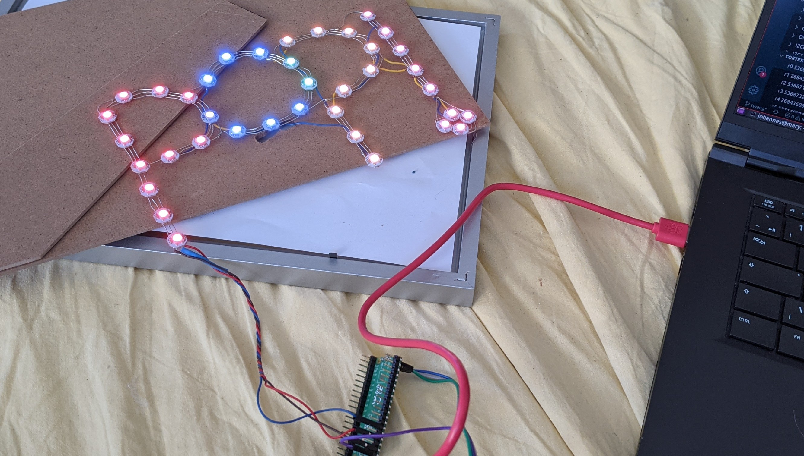

The backside:

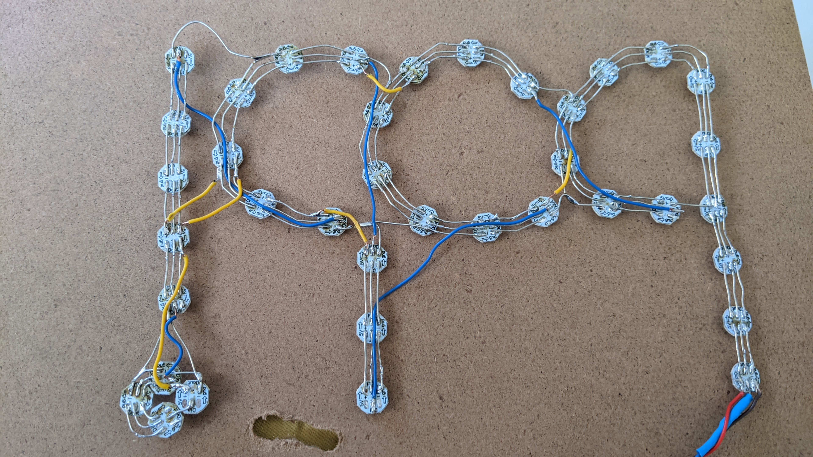

Leading to the final result:

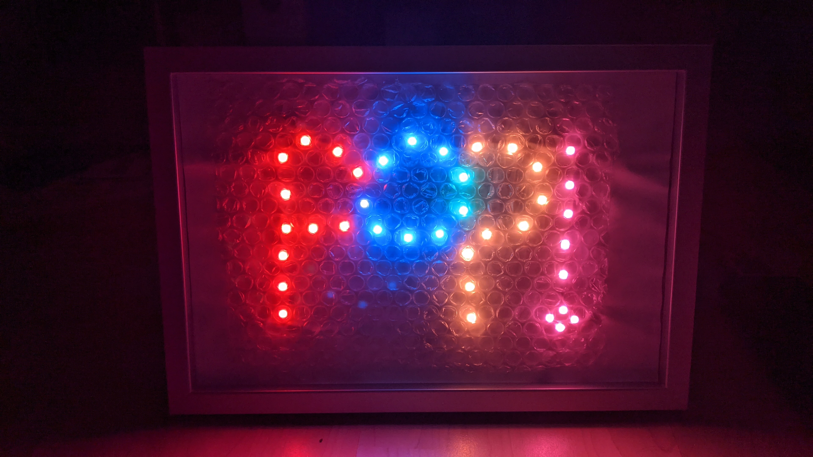

### Animations

With the hardware done, I could focus on animations. There are three kinds of animations:

 * Static colors (as seen above) with a slight shimmer by randomly fluctuating pixel colors
 * Fireworks with rockets and flashing letters
 * A snake wandering through the letters

